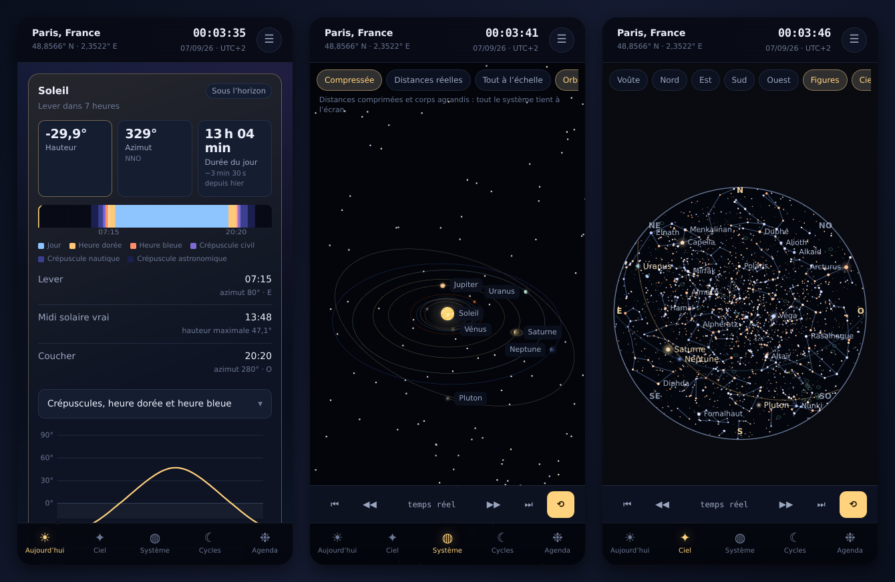

# Céleste

Un système solaire et des éphémérides dans le téléphone. Tout est calculé sur
l'appareil : aucune requête, aucun compte, aucune donnée qui sort. Une fois la
page ouverte une première fois, l'application fonctionne sans réseau.



## Ce que l'application fait

**Aujourd'hui** — le tableau de bord du lieu et du jour. Lever, culmination et
coucher du Soleil et de la Lune, durée du jour et sa variation depuis la veille,
les trois crépuscules, heures dorée et bleue, frise lumineuse des vingt-quatre
heures, planètes visibles maintenant avec leur hauteur et leur constellation,
temps sidéral, équation du temps, points subsolaire et sublunaire.

**Ciel** — un planétarium du lieu, en projection stéréographique. Cinq mille
étoiles jusqu'à la magnitude 6,5 colorées selon leur type spectral, les figures
des 88 constellations, les 110 objets Messier, l'écliptique et l'équateur
céleste, l'horizon et ses points cardinaux. Le fond du ciel s'éclaircit avec la
hauteur du Soleil et les étoiles s'effacent au petit jour, comme dans la
réalité. La Lune y est dessinée avec son terminateur orienté comme vous le
verrez en levant les yeux. Touchez un astre pour l'identifier — ou activez la
**boussole** et dirigez la carte en pointant le téléphone vers le ciel.

**Système** — le système solaire en trois dimensions, aux positions réelles du
moment. Les orbites tracées sont l'échantillonnage des positions calculées sur
une révolution complète : excentricités et inclinaisons y sont donc exactes,
perturbations comprises. Trois échelles au choix, dont un mode « tout à
l'échelle » qui rend sensible le vide du système. Surfaces générées sur
l'appareil, anneaux de Saturne, rotation propre et obliquité, Lune et satellites
galiléens.

**Cycles** — la Lune et le Soleil en détail. Calendrier lunaire du mois dessiné
phase par phase, prochains quartiers, courbe de distance avec périgées et
apogées, librations, éclipses. Côté Soleil : saisons datées à la minute avec la
durée du jour correspondante, courbe annuelle de la durée du jour, amplitude des
levers sur l'horizon, équation du temps, analemme, éclipses locales et globales,
apsides terrestres.

**Agenda** — tout ce qui va se passer dans le ciel, de trois mois à dix ans :
phases, éclipses de Soleil et de Lune, saisons, oppositions, élongations
maximales, apsides, nœuds, pluies de météores et rapprochements planétaires.
Chaque événement ramène l'application à sa date.

**Corps** — une fiche par corps du système solaire : position instantanée,
visibilité, prochains rendez-vous, données physiques et orbitales, atmosphère,
satellites, faits marquants.

**Savoir** — quinze articles pour comprendre ce que l'application montre : les
échelles de l'univers, la formation du système solaire, les saisons, les phases,
les éclipses, les marées, la mesure du temps, la mécanique céleste, la
gravitation, les magnitudes, les coordonnées, le Soleil, l'au-delà du système
solaire, l'observation, et un glossaire.

## Installer sur Android

L'application est une application web installable. Sur le téléphone :

1. ouvrir l'adresse de publication dans Chrome ;
2. menu ⋮, puis **Installer l'application** (ou **Ajouter à l'écran d'accueil**) ;
3. la lancer depuis l'écran d'accueil : elle occupe tout l'écran et fonctionne
   sans connexion.

Sur iPhone, le chemin passe par le bouton Partager puis **Sur l'écran d'accueil**.

Pour en faire une véritable APK — distribution par fichier ou publication sur le
Play Store — voir [docs/android.md](docs/android.md).

Le premier lancement met en cache environ deux mégaoctets — catalogue d'étoiles,
figures des constellations, contours des côtes, moteur d'éphémérides. Ensuite,
plus rien n'est téléchargé.

Un réglage **vision nocturne** bascule l'interface en rouge profond : sur le
terrain, il préserve l'adaptation de l'œil à l'obscurité.

## Faire tourner l'application en local

```sh
npm start          # sert app/ sur http://localhost:8080
```

Il n'y a aucune étape de compilation : `app/` est le site, tel quel. Les seules
dépendances installées (`npm install`) servent aux outils de développement.

```sh
npm test           # 52 tests du moteur et des données
npm run check      # cohérence du dépôt et fraîcheur du service worker
npm run build:data # régénère les catalogues depuis les sources publiques
npm run build:sw   # régénère le service worker et sa liste de pré-cache
npm run build:icons# régénère les icônes PNG depuis l'icône vectorielle
npm run parcours   # parcourt toutes les vues dans un navigateur et relève les erreurs
```

Après toute modification de `app/`, relancer `npm run build:sw` : la version du
cache est l'empreinte du contenu, et `npm run check` échoue si elle a dérivé.

## Comment c'est fait

```
app/                 le site, servi tel quel
  index.html         coquille : en-tête, vue, barre d'onglets
  js/
    core/            état, temps, éphémérides, agenda, formatage, catalogue
    data/            corps du système solaire, lieux, articles, noms
    ui/              fabrique d'éléments, graphiques SVG, textures
    views/           une vue par onglet, chargée à la demande
  data/              catalogues JSON générés
  vendor/            Astronomy Engine et three.js, vendorisés
tools/               génération des données, des icônes, du service worker
tests/               tests du moteur et des données
```

Aucun cadriciel : quelques fonctions de fabrique d'éléments suffisent, et les
vues sont chargées par import dynamique — three.js n'est téléchargé que si l'on
se rend dans la vue tridimensionnelle.

### Choix de conception

**Les positions viennent d'une éphéméride, pas d'éléments moyens.** Chaque corps
est placé par son vecteur héliocentrique calculé, ce qui restitue les
perturbations et non une ellipse idéalisée.

**L'horloge est simulée.** Un point d'ancrage et un taux suffisent à décrire le
temps réel, la pause, l'accélération et le saut à une date arbitraire. Toutes les
vues suivent la même horloge, ce qui permet de mettre le ciel en mouvement.

**Les jours sont les jours de l'observateur.** Les recherches de lever et de
coucher sont bornées par minuit local dans le fuseau choisi, changements d'heure
compris — un jour peut donc durer 23 ou 25 heures.

**Les cas limites sont dits, pas tus.** Un corps circumpolaire, une nuit polaire,
un crépuscule astronomique qui n'a pas lieu de l'été parisien : l'interface
l'indique explicitement plutôt que d'afficher un tiret.

**Les surfaces sont peintes sur l'appareil.** Aucune image n'est téléchargée :
les textures planétaires sont générées par bruit fractal, et la Terre est
dessinée à partir des vrais contours des côtes.

## Exactitude

Les positions du Soleil, de la Lune et des planètes sont exactes à mieux qu'une
minute d'arc sur la période 1700–2200. Les heures de lever et de coucher
tiennent compte de la réfraction atmosphérique moyenne ; les conditions réelles
peuvent les décaler de quelques dizaines de secondes.

Les tests ne comparent pas le moteur à lui-même : ils le confrontent à des faits
indépendants — la déclinaison solaire égale l'obliquité au solstice, l'intervalle
moyen entre nouvelles Lunes vaut le mois synodique, une éclipse se répète un
saros plus tard, la troisième loi de Kepler se vérifie sur les huit planètes et
sur les lunes galiléennes, l'éclipse totale du 2 août 2027 tombe bien sur
l'Égypte.

## Sources et licences

| Élément | Origine | Licence |
| --- | --- | --- |
| Éphémérides | [Astronomy Engine](https://github.com/cosinekitty/astronomy), Don Cross | MIT |
| Rendu 3D | [three.js](https://threejs.org) | MIT |
| Étoiles et constellations | Hipparcos, Yale BSC, via [d3-celestial](https://github.com/ofrohn/d3-celestial) | BSD-3 |
| Ciel profond | Catalogue Messier, via d3-celestial | BSD-3 |
| Contours terrestres | [Natural Earth](https://www.naturalearthdata.com) 110 m | domaine public |
| Données planétaires | NASA/JPL Planetary Fact Sheets, éléments osculateurs J2000 du JPL, UAI | domaine public |

Le code de Céleste est publié sous licence MIT.
